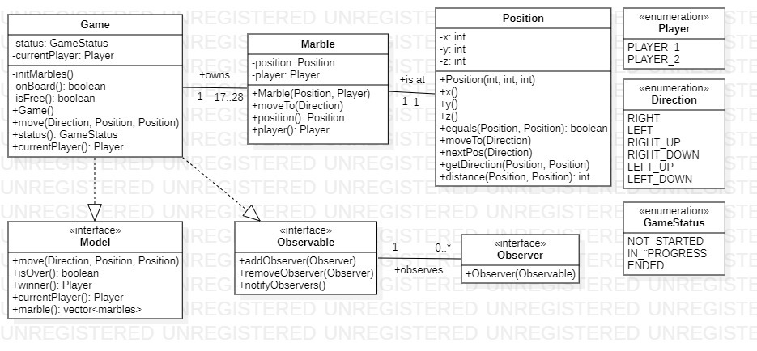

# Project ABALONE 

This is the *documentation* of the Abalone project present in this repository. It includes a C++ project, a gitignore file and this readme file. The project consists of making the real game Abalone (cf. https://en.wikipedia.org/wiki/Abalone_(board_game)). 

Git structure (currently) :

> ------- Abalone
> ------- resources
> ------- .gitignore
> ------- README

We are using QTCreator (c++ 17), StarUML (for diagram).

Authors : BOUKIL Kassem, AZOZ Soliman

### Modelization

We wrote 9 different classes for now : 

- Model
This is the game facade. It is an interface implemented by the class Game and it includes the main functions to be written.

- Game 
This the main class of the project, it contains the functions that will move the marbles, remove them, check if the game
is over or not,...

- Marble
It represents a single marble in the game. It has a *Position* and a *Player*. 

- Position
It represents a position with 3 axes (x, y, z), expected to be used in a two-dimensional array of hexagons.

- Player
Basic enumeration of the two players in the game.

- Direction 
All directions in which to move the marbles. 

- GameStatus
All status in which the game can be.

- Observer
This is the interface for an Observable, which one will be the Model.

- Observable
This is the interface for an Observer, which one will be the View.

The Model diagram : 

### Console 

Not yet.

### GUI

Not yet.