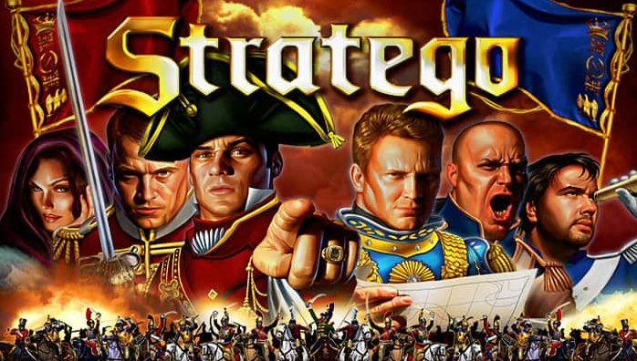
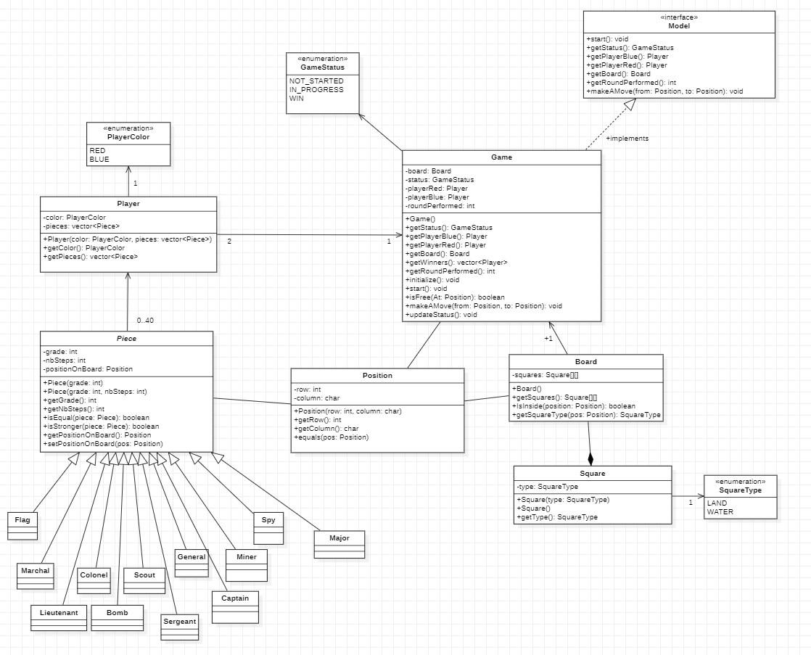

# Project STRATEGO

This is the *documentation* of the Stratego project present in this repository. It includes a C++ project, gitignore file, resources directory and this readme file. 
The project consists of making the real game Stratego (cf. https://en.wikipedia.org/wiki/Stratego)). 

Git structure (currently) :
* Stratego
    * src/
        * strategocore
        * tui
	* gui
    * Stratego.pro.user
* .gitignore
* README

We are using QTCreator (c++ 17), StarUML (for diagram).

Authors : AZOZ Soliman, AZAOUM Adnane

### Importer une template 

Pour pouvoir utiliser ses propres templates, vous devez les mettre dans le meme répértoir que l'executable. A titre d'exemple il y a les templatesRED.txt et templatesBLUE.txt, **elle doivent obligatoirement avoir ce nom**.

### Modelization

*Stratego/src*

- **Model**

This is the game facade. It is an interface implemented by the class Game and it includes the main functions to be written.

- **Game**

The Game class brings together the elements needed for the game.

- **Player**

Represent a player of the game.

- **Piece**

Class to  represent a piece  on the board. It has a *Position*.

- **Position**

Class to represent a position on the game board for exemple: (A1,A2,B2,C3,...).

- **Board**

Represent the board of the game.

- **Square**

Represent a square of the board.

### TUI

*Stratego/src/tui*

The project is now divided in subdirectories : Model + TUI (+Tests)

The tui contains two classes : 

- **Controller** :   
This is the controller of the tui, it coordinates the model and the view and the game begins by calling its method startGam().

- **View** :   
The view displays the board and the different messages of the game in the terminal.

### GUI

*Stratego/src/gui/*

New subdirectory gui is added.  

The gui contains 4 classes :

- **BoardCell** :
This class manages the cells that are displayed on the screen. Each one represents an image.

- **BoardStratego** :
This class manages every cell on the board and the mouvement of mouse.

- **GUIControler** :
The same as the one from tui, it links the model and the view but does not begin the game.

- **MainWindows** :
It manages the view of the gui. Displays and interactions go by this class.

